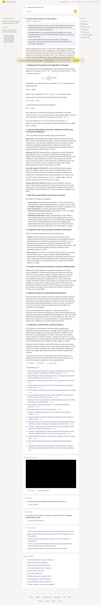

# Visited: https://www.emergentmind.com/topics/common-spatial-patterns-csp
**Time:** Tue May 12 14:46:12 UTC 2026

## Screenshot

## Raw HTML
[page.html](./page.html)

## Downloaded Media (3 files)
## Downloaded Media Files

## Other Links
- [#](#)
- [#continue-learning](#continue-learning)
- [#follow-topic](#follow-topic)
- [#references](#references)
- [#related-topics-common-spatial-patterns-csp](#related-topics-common-spatial-patterns-csp)
- [#topic-content](#topic-content)
- [#video](#video)
- [#whiteboard](#whiteboard)
- [/](/)
- [/history](/history)
- [/labs](/labs)
- [/open-problems](/open-problems)
- [/papers/1510.07263](/papers/1510.07263)
- [/papers/1702.02914](/papers/1702.02914)
- [/papers/1802.09046](/papers/1802.09046)
- [/papers/1808.04443](/papers/1808.04443)
- [/papers/1808.05853](/papers/1808.05853)
- [/papers/1808.06533](/papers/1808.06533)
- [/papers/1907.08977](/papers/1907.08977)
- [/papers/2008.11227](/papers/2008.11227)
- [/papers/2010.10359](/papers/2010.10359)
- [/papers/2109.00740](/papers/2109.00740)
- [/papers/2201.04086](/papers/2201.04086)
- [/papers/2202.04542](/papers/2202.04542)
- [/papers/2303.06019](/papers/2303.06019)
- [/papers/2311.13004](/papers/2311.13004)
- [/papers/2312.00479](/papers/2312.00479)
- [/papers/2411.11879](/papers/2411.11879)
- [/papers/2504.17111](/papers/2504.17111)
- [/pixel-art](/pixel-art)
- [/pixel-art-bench](/pixel-art-bench)
- [/pricing?utm_source=chat-button](/pricing?utm_source=chat-button)
- [/pricing?utm_source=nav](/pricing?utm_source=nav)
- [/self-improving-tweets](/self-improving-tweets)
- [/sponsorship](/sponsorship)
- [/subscribe](/subscribe)
- [/topics/binary-brain-state-classification](/topics/binary-brain-state-classification)
- [/topics/brain-computer-interface-bci](/topics/brain-computer-interface-bci)
- [/topics/brain-state-estimation](/topics/brain-state-estimation)
- [/topics/covariance-tangent-space-projection-cov-tgsp](/topics/covariance-tangent-space-projection-cov-tgsp)
- [/topics/eeg-based-brain-computer-interfaces-bcis](/topics/eeg-based-brain-computer-interfaces-bcis)
- [/topics/eeg-classifiers-for-mental-workload](/topics/eeg-classifiers-for-mental-workload)
- [/topics/eegnet](/topics/eegnet)
- [/topics/non-invasive-brain-computer-interfaces-bcis](/topics/non-invasive-brain-computer-interfaces-bcis)
- [/topics/reliable-components-analysis-rca](/topics/reliable-components-analysis-rca)
- [/topics/spatio-spectral-fusion-mechanism](/topics/spatio-spectral-fusion-mechanism)
- [/users/sign_in](/users/sign_in)
- [/users/sign_up?redirect_to=%2Ftopics%2Fcommon-spatial-patterns-csp](/users/sign_up?redirect_to=%2Ftopics%2Fcommon-spatial-patterns-csp)
- [/users/sign_up?redirect_to=https%3A%2F%2Fwww.emergentmind.com%2Farticles%2Fcommon-spatial-patterns-csp](/users/sign_up?redirect_to=https%3A%2F%2Fwww.emergentmind.com%2Farticles%2Fcommon-spatial-patterns-csp)
- [/users/sign_up?redirect_to=https%3A%2F%2Fwww.emergentmind.com%2Ftopics%2Fcommon-spatial-patterns-csp](/users/sign_up?redirect_to=https%3A%2F%2Fwww.emergentmind.com%2Ftopics%2Fcommon-spatial-patterns-csp)

## Stats
- Links: 179
- Media: 3
