## Downloaded Media Files

- [1091-independent-component-analysis-of-electroencephalographic-data.pdf](./media/1091-independent-component-analysis-of-electroencephalographic-data.pdf) (1417 KB)
- [1343-extended-ica-removes-artifacts-from-electroencephalographic-recordings.pdf](./media/1343-extended-ica-removes-artifacts-from-electroencephalographic-recordings.pdf) (1735 KB)
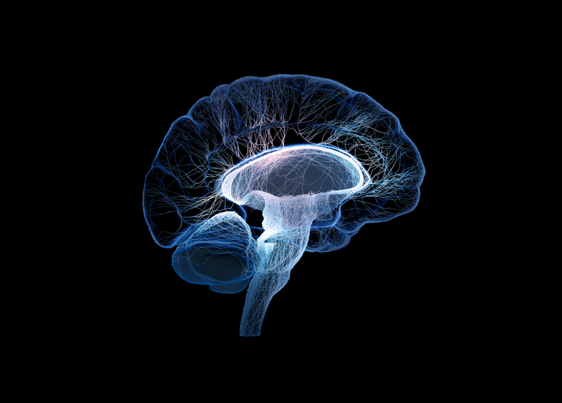

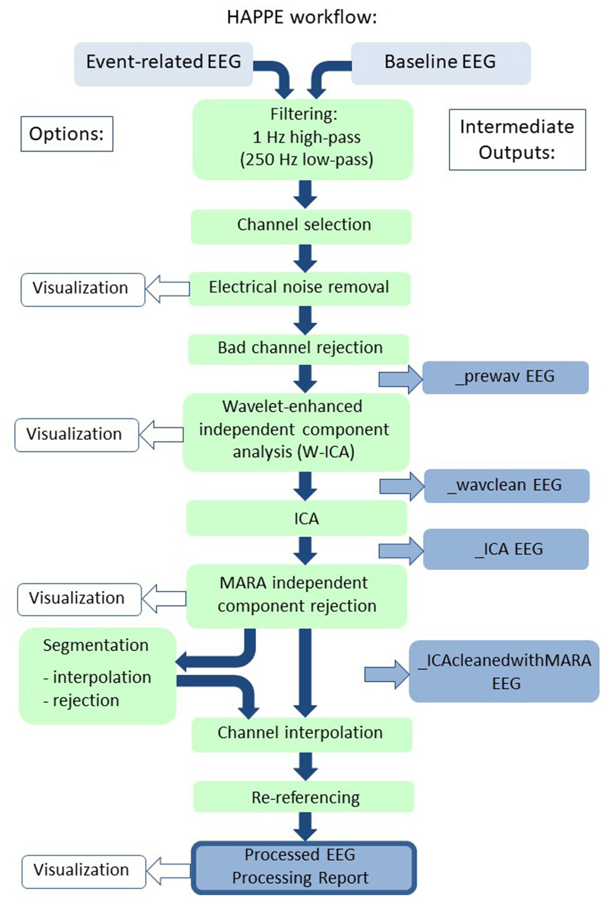
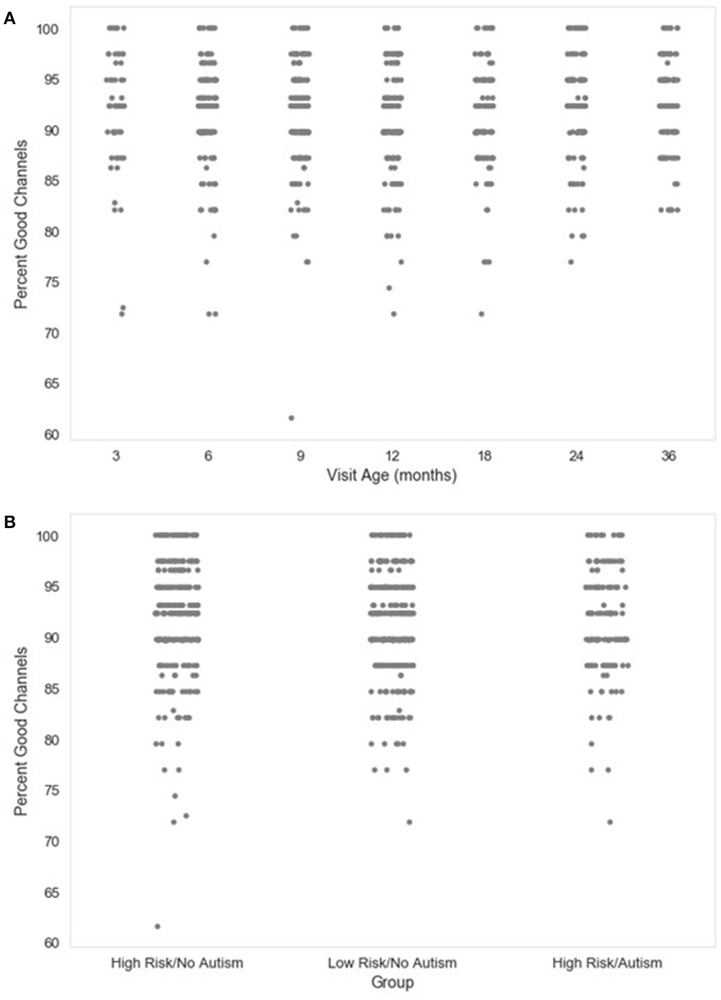
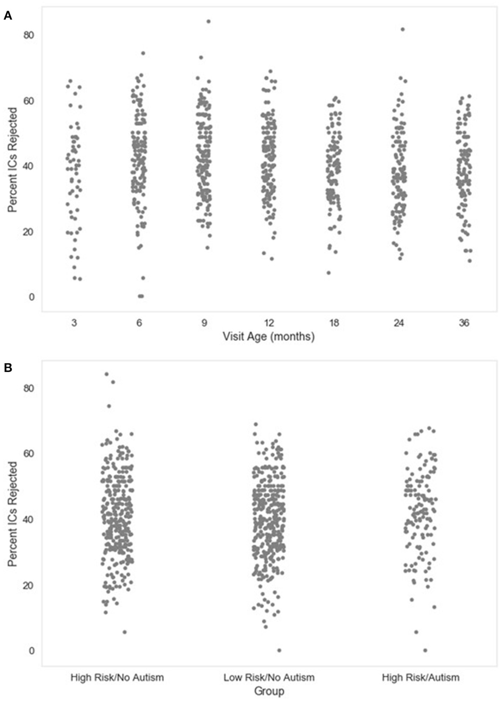
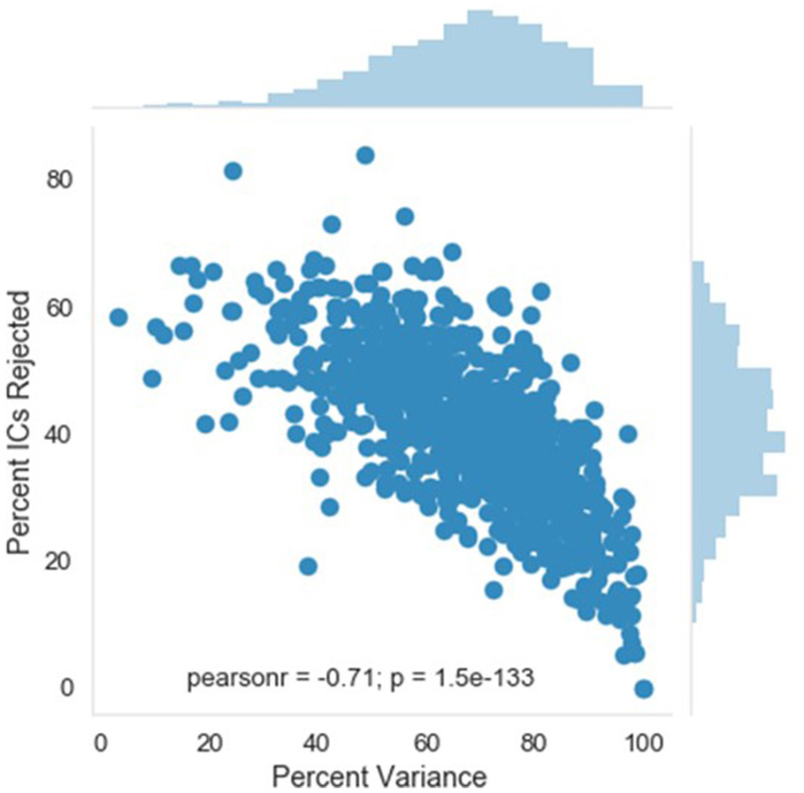
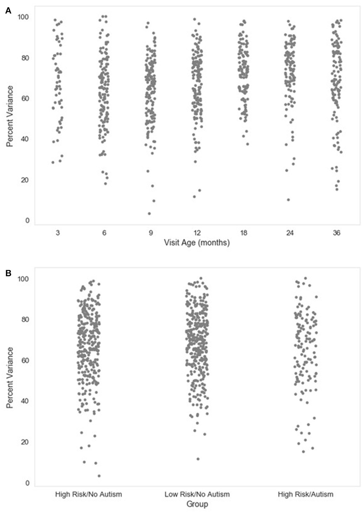
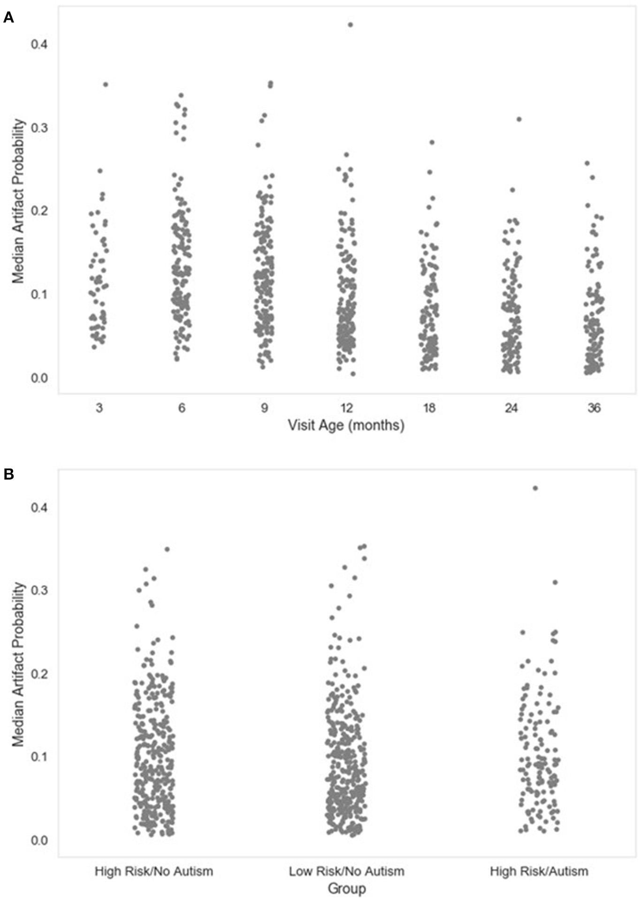
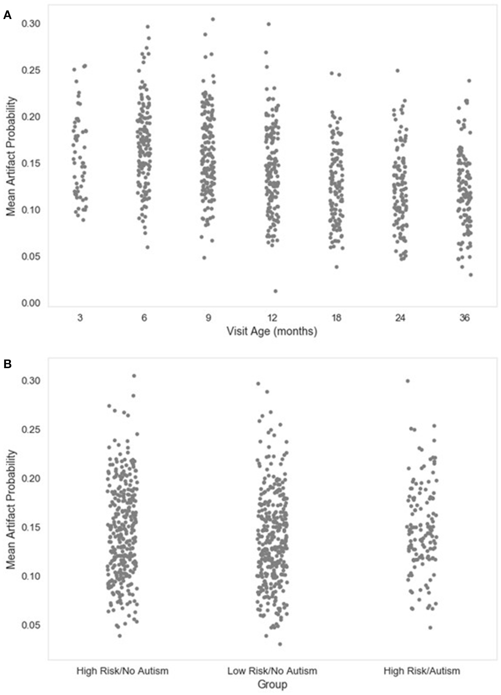
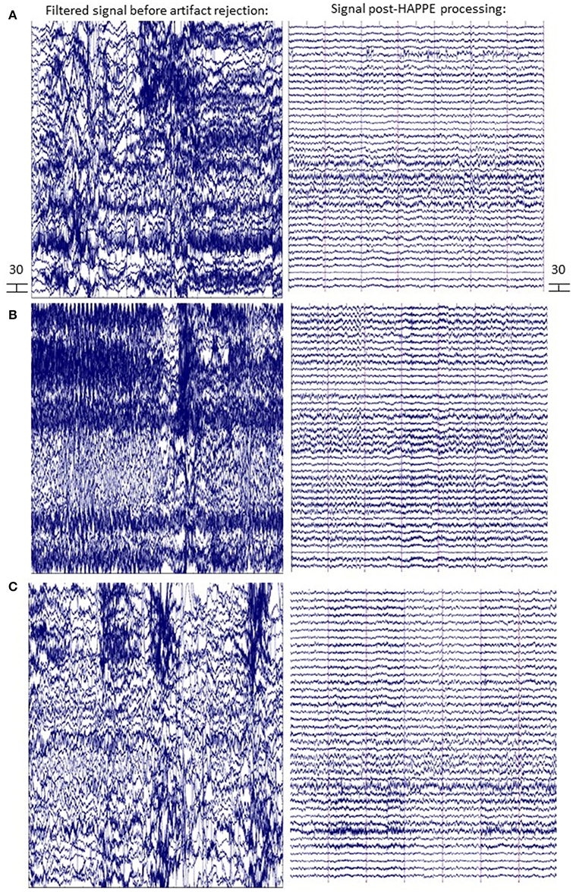
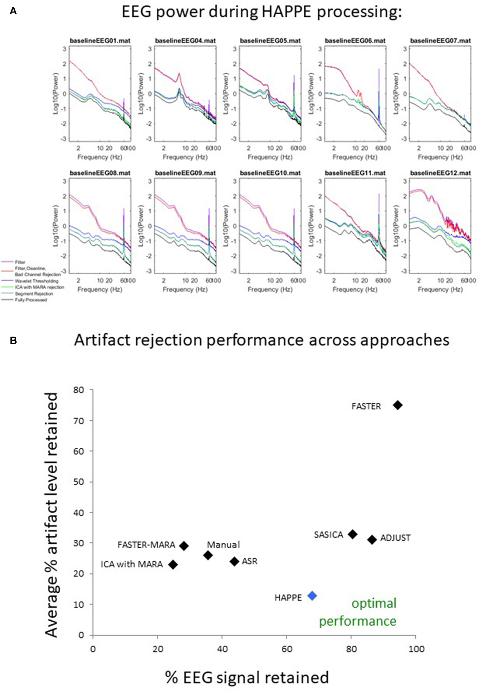
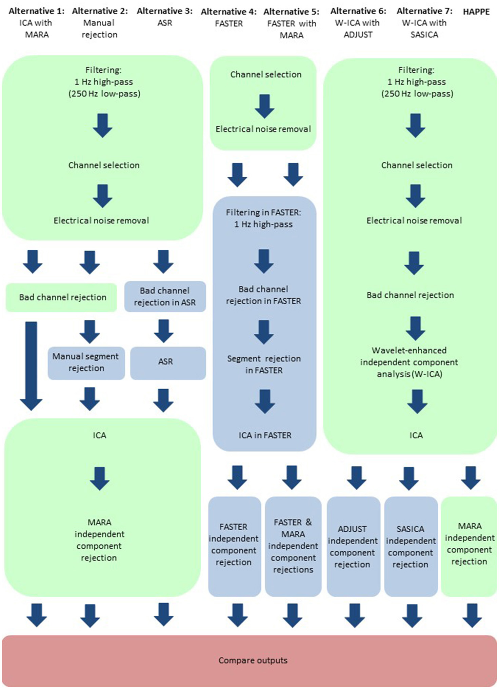
