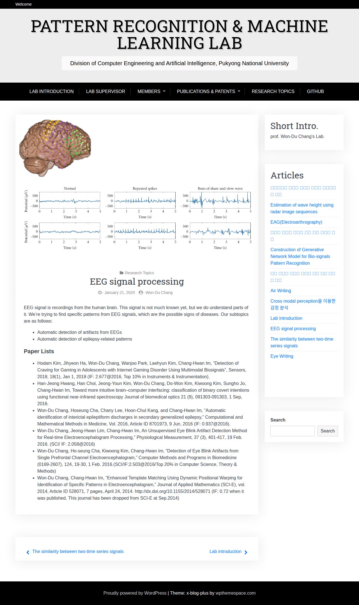

# Visited: https://pkai.pknu.ac.kr/index.php/2020/01/21/eeg-signal-processing/
**Time:** Thu May  7 19:12:31 UTC 2026

## Screenshot

## Raw HTML
[page.html](./page.html)

## Downloaded Media (4 files)
## Downloaded Media Files

## Other Links
- [#content](#content)
- [http://gmpg.org/xfn/11](http://gmpg.org/xfn/11)
- [https://github.com/PKNU-PR-ML-Lab](https://github.com/PKNU-PR-ML-Lab)
- [https://pkai.pknu.ac.kr/](https://pkai.pknu.ac.kr/)
- [https://pkai.pknu.ac.kr/index.php/2020/01/21/eeg-signal-processing/](https://pkai.pknu.ac.kr/index.php/2020/01/21/eeg-signal-processing/)
- [https://pkai.pknu.ac.kr/index.php/2020/01/21/eye-writing/](https://pkai.pknu.ac.kr/index.php/2020/01/21/eye-writing/)
- [https://pkai.pknu.ac.kr/index.php/2020/01/21/the-similarity-between-two-time-series-signals/](https://pkai.pknu.ac.kr/index.php/2020/01/21/the-similarity-between-two-time-series-signals/)
- [https://pkai.pknu.ac.kr/index.php/2022/12/02/lab-introduction/](https://pkai.pknu.ac.kr/index.php/2022/12/02/lab-introduction/)
- [https://pkai.pknu.ac.kr/index.php/2023/07/07/cross-modal-perception/](https://pkai.pknu.ac.kr/index.php/2023/07/07/cross-modal-perception/)
- [https://pkai.pknu.ac.kr/index.php/2023/07/10/air-writing/](https://pkai.pknu.ac.kr/index.php/2023/07/10/air-writing/)
- [https://pkai.pknu.ac.kr/index.php/2023/07/10/construction-of-generative-network-model-for-bio-signals-pattern-recognition/](https://pkai.pknu.ac.kr/index.php/2023/07/10/construction-of-generative-network-model-for-bio-signals-pattern-recognition/)
- [https://pkai.pknu.ac.kr/index.php/2023/07/10/denoise-of-camera-footage-from-inclement-weather/](https://pkai.pknu.ac.kr/index.php/2023/07/10/denoise-of-camera-footage-from-inclement-weather/)
- [https://pkai.pknu.ac.kr/index.php/2023/07/10/side_scan_sonar/](https://pkai.pknu.ac.kr/index.php/2023/07/10/side_scan_sonar/)
- [https://pkai.pknu.ac.kr/index.php/2023/07/11/eagelectroarthrography/](https://pkai.pknu.ac.kr/index.php/2023/07/11/eagelectroarthrography/)
- [https://pkai.pknu.ac.kr/index.php/2023/07/11/estimation-of-wave-height-using-radar-image-sequences/](https://pkai.pknu.ac.kr/index.php/2023/07/11/estimation-of-wave-height-using-radar-image-sequences/)
- [https://pkai.pknu.ac.kr/index.php/2023/07/11/underwater-sound-source-detection/](https://pkai.pknu.ac.kr/index.php/2023/07/11/underwater-sound-source-detection/)
- [https://pkai.pknu.ac.kr/index.php/alumni/](https://pkai.pknu.ac.kr/index.php/alumni/)
- [https://pkai.pknu.ac.kr/index.php/author/pr_ml_lab/](https://pkai.pknu.ac.kr/index.php/author/pr_ml_lab/)
- [https://pkai.pknu.ac.kr/index.php/books/](https://pkai.pknu.ac.kr/index.php/books/)
- [https://pkai.pknu.ac.kr/index.php/category/research-topics/](https://pkai.pknu.ac.kr/index.php/category/research-topics/)
- [https://pkai.pknu.ac.kr/index.php/comments/feed/](https://pkai.pknu.ac.kr/index.php/comments/feed/)
- [https://pkai.pknu.ac.kr/index.php/feed/](https://pkai.pknu.ac.kr/index.php/feed/)
- [https://pkai.pknu.ac.kr/index.php/lab-supervisor/](https://pkai.pknu.ac.kr/index.php/lab-supervisor/)
- [https://pkai.pknu.ac.kr/index.php/members/](https://pkai.pknu.ac.kr/index.php/members/)
- [https://pkai.pknu.ac.kr/index.php/publications-patents/](https://pkai.pknu.ac.kr/index.php/publications-patents/)
- [https://pkai.pknu.ac.kr/index.php/research-topics/](https://pkai.pknu.ac.kr/index.php/research-topics/)
- [https://pkai.pknu.ac.kr/index.php/wp-json/](https://pkai.pknu.ac.kr/index.php/wp-json/)
- [https://pkai.pknu.ac.kr/index.php/wp-json/oembed/1.0/embed?url=https%3A%2F%2Fpkai.pknu.ac.kr%2Findex.php%2F2020%2F01%2F21%2Feeg-signal-processing%2F](https://pkai.pknu.ac.kr/index.php/wp-json/oembed/1.0/embed?url=https%3A%2F%2Fpkai.pknu.ac.kr%2Findex.php%2F2020%2F01%2F21%2Feeg-signal-processing%2F)
- [https://pkai.pknu.ac.kr/index.php/wp-json/oembed/1.0/embed?url=https%3A%2F%2Fpkai.pknu.ac.kr%2Findex.php%2F2020%2F01%2F21%2Feeg-signal-processing%2F&#038;format=xml](https://pkai.pknu.ac.kr/index.php/wp-json/oembed/1.0/embed?url=https%3A%2F%2Fpkai.pknu.ac.kr%2Findex.php%2F2020%2F01%2F21%2Feeg-signal-processing%2F&#038;format=xml)
- [https://pkai.pknu.ac.kr/index.php/wp-json/wp/v2/posts/83](https://pkai.pknu.ac.kr/index.php/wp-json/wp/v2/posts/83)
- [https://pkai.pknu.ac.kr/wp-includes/wlwmanifest.xml](https://pkai.pknu.ac.kr/wp-includes/wlwmanifest.xml)
- [https://pkai.pknu.ac.kr/xmlrpc.php?rsd](https://pkai.pknu.ac.kr/xmlrpc.php?rsd)
- [https://wordpress.org/](https://wordpress.org/)
- [https://wpthemespace.com/product/x-blog](https://wpthemespace.com/product/x-blog)

## Stats
- Links: 38
- Media: 4
